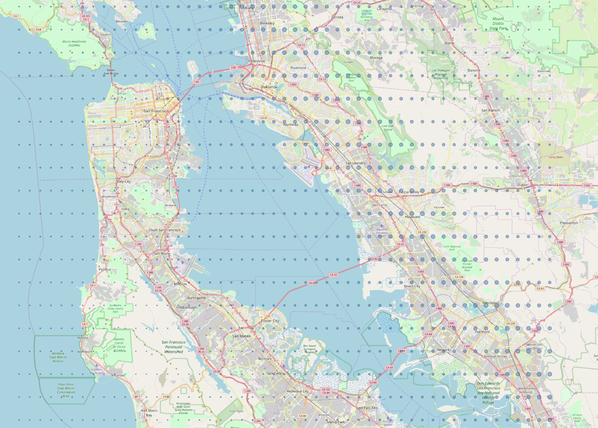

# EQScenario
EQScenario is a console application developed by the Simcenter to facilitate performing seismic hazard analysis(SHA) for regional earthquake simulations. The application makes use of [OpenSHA](http://www.opensha.org/) to perform deterministic SHA[1]. This application is developed using Java to facilitate the use of OpenSHA Java library. It is worth noting that this tool is most suitable for research applications where SHA needs to be performed for many sites given a single earthquake scenario, such as using a grid of sites for regional simulations.

## User's Guide
The EQScenario tool can be used to obtain ground motion intensity measures(IM), such as peak ground acceleration(PGA) or spectral accelerations(SA), at a specific site or a grid of sites, assuming a scenario earthquake rupture occurring. The application allows computing the intensity measure using different ground motion prediction equations (GMPE) provided by OpenSHA. The tool takes the following as its input:

*	**Earthquake Rupture**: either a point source with magnitude, or a rupture defined in one of the Earthquake Rupture Forecasts(ERF) provided by OpenSHA.
*	**Site**: a single location or a grid of locations.
*	**GMPE**: the attenuation relationship used to estimate the IM mean and standard deviation.

The output of the tool is 
*	**IM**: Mean and standard deviation of the intensity measure at the sites specified
*	**Site Data**: data available for the site that was obtained during the analysis such as Vs30, Depth 1.0 km/s and Depth 2.5km/s

At its core this tool uses OpenSHA, which provides the implementation of the GMPEs and data for the ERFs, where an EQ scenario can be selected. In addition, Site data is available in OpenSHA through different providers.

The following GMPE implementations provided by OpenSHA can be used: 
1.	Abrahamson, Silva & Kamai (2014)
2.	Boore, Stewart, Seyhan & Atkinson (2014)
3.	Campbell & Bozorgnia (2014)
4.	Chiou & Youngs (2014)
5.	Idriss (2014)
6.	Campbell & Bozorgnia (2008)
7.	Boore & Atkinson (2008)
8.	Abrahamson & Silva (2008)
9.	Chiou & Youngs (2008)
10.	Boore & Atkinson (2006)
11.	Chiou & Youngs (2006)
12.	Campbell & Bozorgnia (2006)
13.	Campbell and Bozorgnia (2003)
14.	Field (2000)
15.	Campbell (1997) w/ erratum (2000) changes
16.	Abrahamson & Silva (1997)
17.	Boore, Joyner & Fumal (1997)

An earthquake rupture can be defined as a point source, using magnitude, location, dip and rake. In addition, the tool allows using one of the ERFs available by OpenSHA to specify an earthquake source and rupture, the ERFs available to use are:
1.	WGCEP (2007) UCERF2 - Single Branch
2.	USGS/CGS 2002 Adj. Cal. ERF
3.	WGCEP UCERF 1.0 (2005)
4.	GEM1 CEUS ERF
5.	Mean UCERF3
6.	Mean UCERF3 FM3.1
7.	Mean UCERF3 FM3.2

Additionally, the following site providers are used to obtain site data, if available:
|Site Data Provider|Site Data Types|
|------------------|:-------------|
|CGS/Wills VS30 Map (2015)|`Vs30` and `Vs30 measurement type`|
|CGS/Wills Site Classification Map (2006)|`Vs30` and `Vs30 measurement type`|
|Global Vs30 from Topographic Slope (Wald & Allen 2008)|`Vs30` and `Vs30 measurement type`|
|SCEC Community Velocity Model Version 4, Iteration 26, Basin Depth| `Depth to Vs = 2.5 km/sec` and `Depth to Vs = 1.0 km/sec`|
|SCEC CCA, Iteration 6, Basin Depth|`Depth to Vs = 2.5 km/sec` and `Depth to Vs = 1.0 km/sec`|
|SCEC Community Velocity Model Version 4 Basin Depth|`Depth to Vs = 2.5 km/sec` and `Depth to Vs = 1.0 km/sec`|
|SCEC/Harvard Community Velocity Model Version 11.9.0 Basin Depth|`Depth to Vs = 2.5 km/sec` and `Depth to Vs = 1.0 km/sec`|
|SCEC CCA, Iteration 6, Basin Depth|`Depth to Vs = 2.5 km/sec` and `Depth to Vs = 1.0 km/sec`|
|SCEC Community Velocity Model Version 4, Iteration 26, Vs30|`Vs30` and `Vs30 measurement type`|
|SCEC Community Velocity Model Version 2 Basin Depth|`Depth to Vs = 2.5 km/sec`|
|CGS/Wills Preliminary Site Classification Map (2000)|Wills Site Class|
-------------------------
It has to be noted that this is an ordered list of the providers according to preference, which is the default setting in OpenSHA library. If no site data is available, then the GMPE default values are used.

The inputs for the EQScenario tool is in json format, and the output can be in json format or comma separated values(csv) format. Optionally, outputs in GeoJson format can be provided as well  to facilitate visualization in GIS application, as shown in the figure.



Please refer to [OpenSHA documenation](http://www.opensha.org/overview) for more information about the GMPEs, ERFs and site data providers available.

### Usage
Using EQScenario is simple, the EQScenario tool is distributed as a jar file and can executed directly using:
```
java -jar EQScenario Scenario.json Output.json
```
Scenario.json is the name of the input file and output.json is the name to be used for the resulting output file.

### Input file format
The input file is written in json format and provides four json objects to specify the site, an earthquake rupture, a GMPE and an IM.
```json
{
	"Site": {...},
	"EqRupture": {...},
	"GMPE": {...},
	"IntensityMeasure": {...}
}
```

A site object specifies either a single location or a grid of locations where IMs will be computed. For single location, the site json object will be as follows:
```json
{
    "Type": "SingleLocation",
    "Location": {
        "Latitude": 37.9,
        "Longitude": -122.3
    }
}
```

For a grid of locations, the site object needs to be specified as follows:
```json
{
    "Type": "Grid",
    "Grid": {
        "Latitude": {
            "Min": 37.0,
            "Max": 38.2,
            "Divisions": 50
        },
        "Longitude": {
            "Min": -122.6,
            "Max": -121.9,
            "Divisions": 50
        }
    }
}
```
Next, we need to specify an earthquake scenario to be used in the analysis. This is done by specifiying the EqRupture object either as a `PointSource` or using and a rupture forcast. When specifing a rupture as a point source, information about the rupture magnitude, location and geometry needs to be provided as follows:
```json
{
    "Type": "PointSource",
    "Magnitude": 7.0,
    "Location": {
        "Latitude": 37.9,
        "Longitude": -122.3,
        "Depth": 0.0
    },
    "AverageRake": 0.0,
    "AverageDip": 90.0
}
```

To specify a rupture using an ERF, only the ERF name, source index and rupture index need to be provided as follows:
```json
{
    "Type": "ERF",
    "RuptureForecast": "WGCEP (2007) UCERF2 - Single Branch",
    "SourceIndex": 28,
    "RuptureIndex": 7
}
```

in that case the output will include the information of the rupture used such as magnitude, location and geometry.

Specifying the GMPE is as simple as providing its name. An example GMPE object is:
```json
{
    "Type": "Boore, Stewart, Seyhan & Atkinson (2014)",
}
```

Finally, the required IM is specified in the IM json object as follows:
```json
{
    "Type": "SA",
    "Periods": [0.05, 0.1, 0.2, 0.5, 1.0, 2.0, 5.0, 10.0],
    "EnableJsonOutput": true,
    "EnableCsvOutput": false,
    "EnableGeoJsonOutput": true
}
```

The type value can be `SA`, `PGA` or `PGV`. If `SA` is specified, then periods for which spectral acceleration is computed will need to be provided as well. The IM object also specifies the output files that will be produced.


### Output file format 
The ouput file is a json file that provides the IM specified in the input. In addition, site data and earthquake rupture data are included in the output as well.

```json
{
  "EqRupture": {...},
  "GroundMotions": [
    {
      "Location": {...},
      "SiteData": [
        {
          "Type": "Vs30",
          "Value": 733.4,
          "Source": "CGS/Wills VS30 Map (2015)"
        },...
      ],
      "PGA": {
        "Mean": -0.541051677220727,
        "TotalStdDev": 0.5728796095058123,
        "InterEvStdDev": 0.3107509502350554,
        "IntraEvStdDev": 0.4812742398212708
      }
    }
  ]
}
```

Optionally, the tool can output the resutls in GeoJson format, which is suitable for visulization in GIS tools (e.g. [QGis](https://www.qgis.org)).

```json
{
  "Type": "FeatureCollection",
  "Features": [
    {
      "Type": "Feature",
      "Geometry": {
        "Type": "Point",
        "Coordinates": [
          -122.2585,
          37.8719
        ]
      },
      "Properties": {
        "Vs30": 733.4,
        "Vs30 Type": "Inferred",
        "MeanPGA": -0.541051677220727,
        "Depth 2.5 km/sec": 15.0,
        "Depth 1.0 km/sec": 15000.0
      }
    }
  ]
}
```


## Examples

### Example 1: Single Site and a Point Source Rupture
In this example, we will use the tool to calculate the PGA at a single site given a 7.05M earthquake occuring at a specified location. The site where the PGA is calculated is located in Berkeley, CA and the earthquake rupture is modeled with a simplified point source along the hayward fault, based on the main shock of the [Haywired earthquake scenario](https://doi.org/10.3133/sir20175013). The earthquake rupture hypocenter in this scenario is located in Oakland, CA. The input for this example ([Scenario1.json](examples/Scenario1.json)) is:

```json
{
	"Site": {
		"Type": "SingleLocation",
		"Location": {
			"Latitude": 37.8719,
			"Longitude": -122.2585
		}
	},
	"EqRupture": {
		"Type": "PointSource",
		"Magnitude": 7.05,
		"Location": {
			"Latitude": 37.9,
			"Longitude": -122.3,
			"Depth": 0.0
		},
		"AverageRake": 0.0,
		"AverageDip": 90.0
	},
	"GMPE": {
		"Type": "Campbell & Bozorgnia (2014)",
	},
	"IntensityMeasure": {
		"Type": "PGA",
		"EnableJsonOutput": true,
		"EnableCsvOutput": true
	}
}
```
The following command can be used to run this example:
```shell
java -jar EQScenario Scenario1.json Scenario1_PGA.json
```

The resulting output file is:
```json
{
  "EqRupture": {
    "Type": "PointSource",
    "Magnitude": 7.05,
    "Location": {
      "Latitude": 37.9,
      "Longitude": -122.3,
      "Depth": 0.0
    },
    "AverageRake": 0.0,
    "AverageDip": 90.0
  },
  "GroundMotions": [
    {
      "Location": {
        "Latitude": 37.8719,
        "Longitude": -122.2585
      },
      "SiteData": [
        {
          "Type": "Vs30",
          "Value": 733.4,
          "Source": "CGS/Wills VS30 Map (2015)"
        },
        {
          "Type": "Vs30 Type",
          "Value": "Inferred",
          "Source": "CGS/Wills VS30 Map (2015)"
        },
        {
          "Type": "Depth 1.0 km/sec",
          "Value": 15000.0,
          "Source": "SCEC CCA, Iteration 6, Basin Depth"
        },
        {
          "Type": "Depth 2.5 km/sec",
          "Value": 15.0,
          "Source": "SCEC CCA, Iteration 6, Basin Depth"
        }
      ],
      "PGA": {
        "Mean": -0.541051677220727,
        "TotalStdDev": 0.5728796095058123,
        "InterEvStdDev": 0.3107509502350554,
        "IntraEvStdDev": 0.4812742398212708
      }
    }
  ]
}
```
The GeoJson output file is:
```json
{
  "Type": "FeatureCollection",
  "Features": [
    {
      "Type": "Feature",
      "Geometry": {
        "Type": "Point",
        "Coordinates": [
          -122.2585,
          37.8719
        ]
      },
      "Properties": {
        "Vs30": 733.4,
        "Vs30 Type": "Inferred",
        "MeanPGA": -0.541051677220727,
        "Depth 2.5 km/sec": 15.0,
        "Depth 1.0 km/sec": 15000.0
      }
    }
  ]
}
```

### Example 2: SF Bay area site grid and a rupture using Uniform Calfornia ERF
In this example, response spectra are calculated for a grid of sites in the San Francisco bay area region. The rupture is chosen from UCERF3, and is a 7.25M earthquake along the hayward fault.

The input file ([Scenario2.json](examples/Scenario2.json)) for this example is:
```json
{
	"Site": {
		"Type": "Grid",
		"Grid": {
			"Latitude": {
				"Min": 37.0,
				"Max": 38.2,
				"Divisions": 25
			},
			"Longitude": {
				"Min": -122.6,
				"Max": -121.9,
				"Divisions": 25
			}
		}
	},
	"EqRupture": {
		"Type": "ERF",
		"RuptureForecast": "WGCEP (2007) UCERF2 - Single Branch",
		"SourceIndex": 28,
		"RuptureIndex": 7
	},
	"GMPE": {
		"Type": "Boore, Stewart, Seyhan & Atkinson (2014)",
		"Parameters": {}
	},
	"IntensityMeasure": {
		"Type": "SA",
		"Periods": [0.05, 0.1, 0.2, 0.5, 1.0, 2.0, 5.0, 10.0],
		"EnableJsonOutput": true,
		"EnableCsvOutput": false,
		"EnableGeoJsonOutput": true
	}
}
```

The following command can be used to run this example:
```shell
java -jar EQScenario Scenario2.json Scenario2_SA.json
```

The output files of this example are extensive and are not directly show in this document. They can be viewed from these link:
* [Scenario 2 IMs](examples/Scenario2_SA_Output.json)
* [Scenario 2 GeoJson](examples/Scenario2_SA_Geo.json)

## Developer's Guide
### Dependencies
This tool has two dependencies:

1. [OpenSHA library](http://www.opensha.org/develop): OpenSHA is used as a library to provide the necessary SHA functionality, such as GMPE, ERFs, site data providers.
2. [Google Gson library](https://github.com/google/gson): The Gson library is used for serialization and deserialization of Json objects.

Both libraries are included with the source code.

### Build and debug in Eclipse IDE
To build the tool from source using Eclipse IDE:
1. Open the EQScenario folder in Eclipse IDE.
2. In the package explorer, expand the ant folder.
3. Right click on EQScenarioBuild.xml and click Run As > Ant Build.
4. The resulting jar file will be created in the build folder

To debug the tool:
1. Open the EQScenario folder in Eclipse IDE.
2. In the package explorer, expand the src folder.
3. Right click on `EQScenarioCalc.java` and click Debug As > Java Application.

### Unit Testing
Unit tests using the JUnit framework are included in the test folder. The following steps can be used to run the all the tests:
1. Open the EQScenario folder in Eclipse IDE.
2. Right click on the test folder and click Run As > JUnit Test.
3. The Junit dialog will show the results of running the tests.

Tests can also be run separately by selecting an individual test file and running it. Three different set of tests are being used for testing GMPEs, ERFs and SHA results.

## License
Gson is distributed under the Apache 2.0 license, Copyright 2008 Google Inc.

OpenSHA is distributed under the Apache 2.0 license, Copyright 2010 OpenSHA.org and the University of Southern California (USC).

EQScenario source and executable files are distributed under the included [license](License), Copyright 2018 The Regents of the University of California.

## TODO
These are features that are expected to be added in the near future:
* Finite source rupture
* Sites with list of locations
* Site tag
* Rupture search mode
* Output rupture GeoJon file

## References
[1] Field, E.H., T.H. Jordan, and C.A. Cornell (2003), OpenSHA: A Developing Community-Modeling Environment for Seismic Hazard Analysis, Seismological Research Letters, 74, no. 4, p. 406-419.

